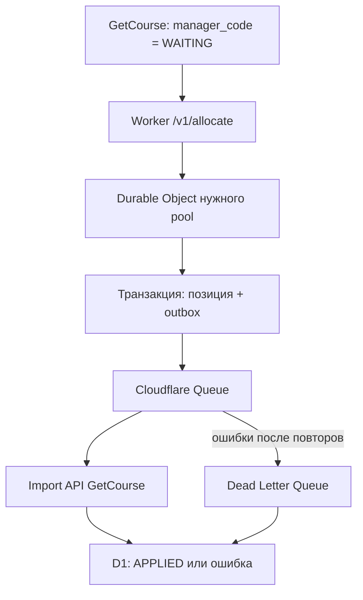

# GC Manager Round Robin for Cloudflare v2.1.0

Надёжный распределитель пользователей GetCourse между персональными
менеджерами строго по кругу. Система рассчитана на несколько сегментов и
несколько процессов, работающих одновременно.

## Что обеспечивает эта сборка

- Каждый `pool` имеет собственную независимую очередь: `segment_1`,
  `segment_2` и т. д.
- Внутри одного `pool` назначения идут строго по порядку: 1 → 2 → 3 → … → 1.
- Уже закреплённый персональный менеджер намеренно не проверяется: повторное
  назначение разрешено по требованиям проекта.
- `run_key` отсутствует полностью.
- Параллельные запросы одного сегмента сериализуются Durable Object, поэтому
  два запроса не могут одновременно взять одну и ту же позицию счётчика.
- Код и задание на запись сохраняются в одной транзакции локального SQLite
  Durable Object.
- GetCourse получает короткий ответ `ACCEPTED` и не ждёт обращения к своему
  API. Это убирает прежнюю причину тайм-аута в 10 секунд.
- Запись `manager_code` выполняется через Cloudflare Queue, последовательно,
  с экспоненциальными повторами.
- Повторная доставка сообщения безопасна: повторно записывается тот же код,
  а не выдаётся новый менеджер.
- Необрабатываемые задания попадают в Dead Letter Queue и остаются в D1 со
  статусом `DEAD`.
- `repair` повторяет прежнее назначение и не сдвигает очередь.
- Если отправка из Durable Object в Queue временно не удалась, локальный
  outbox сохраняет задание; Alarm и резервный Cron раз в пять минут пытаются
  отправить его снова.
- При повторных сбоях outbox увеличивает паузу до 15 минут, поэтому недоступная
  Queue не создаёт бесконечный частый цикл запросов.
- Аварийная Queue имеет собственного consumer: исчерпанные задания сохраняются
  в D1 `dead_letters`, а не зависят только от 24-часового срока Queue.
- Схема D1 применяется автоматически во время Deploy.
- Список пулов и менеджеров хранится в `src/manager-config.js` и синхронизируется
  атомарно только после явного флага готовности.
- Каждый GitHub Deploy сначала выполняет 20 unit- и 13 интеграционных тестов;
  неисправная сборка не должна публиковаться.

## Схема работы

## Почему это надёжнее предыдущего варианта

Предыдущий Google Apps Script держал общий lock, работал с Google Sheets и
обращался к GetCourse API до отправки ответа. Всё это должно было уложиться в
лимит GetCourse около 10 секунд. При одновременных карточках возникал ответ
`Operation timed out after 10001 milliseconds`.

В этой версии критический HTTP-путь состоит только из проверки запроса,
чтения небольшого списка менеджеров и одной атомарной операции Durable Object.
Медленное обращение к GetCourse вынесено в очередь и не влияет на ответ
вебхуку.

## Важная граница гарантии

Cloudflare Queue использует модель доставки «как минимум один раз». Код
учитывает это и делает запись идемпотентной. Однако обычный повторный вызов
`/v1/allocate` считается новым назначением — это требуемое поведение без
`run_key`. Поэтому ветка ошибки GetCourse не должна повторно вызывать
`/v1/allocate`. Для исправления используется только `repair` или защищённая
административная команда `requeue`.

## Состав комплекта

| Файл | Назначение |
|---|---|
| `src/worker.js` | Worker, Durable Object, Queue consumer, Cron и админ-методы |
| `src/core.js` | Проверки данных, конфигурации, round-robin и ответа GetCourse |
| `src/manager-config.js` | Список пулов, порядка и активных менеджеров |
| `migrations/` | Автоматически применяемая схема D1 |
| `schema.sql` | Справочная полная схема D1 |
| `wrangler.jsonc` | Связи Worker, D1, Durable Object и двух очередей |
| `INSTALL-RU.md` | GitHub → Deploy to Cloudflare без терминала |
| `GETCOURSE-SETUP-RU.md` | Точная настройка процесса GetCourse |
| `OPERATIONS-AND-RECOVERY-RU.md` | Контроль, изменение менеджеров и восстановление |
| `TEST-CHECKLIST-RU.md` | Безопасный приёмочный тест |
| `VERIFICATION-REPORT-RU.md` | Что уже проверено и что требует теста вашей школы |
| `SECRET-GENERATOR.html` | Локальное создание двух секретов без внешнего сайта |

## Лимиты и рекомендуемый тариф

На Workers Free Cloudflare сейчас включает 10 000 операций Queue в день.
Обычная доставка одного задания обычно расходует три операции: запись, чтение
и удаление. Поэтому теоретический предел без повторов — около 3 333 заданий в
сутки. Практический комфортный диапазон — до 2 000, а 2 000–2 500 требует
контроля retries. При повторных попытках расход выше.

Для рабочего процесса, где остановка критична, рекомендуется Workers Paid:
у Free превышение жёсткого дневного лимита приводит к отказу операций, а
сообщения Queue хранятся только 24 часа. Актуальные значения:

- [Cloudflare Queues pricing](https://developers.cloudflare.com/queues/platform/pricing/)
- [Durable Objects pricing](https://developers.cloudflare.com/durable-objects/platform/pricing/)
- [Durable Objects setup](https://developers.cloudflare.com/durable-objects/get-started/)

Даже на Paid необходимо оставить ветку `WAITING` и уведомление администратору
в GetCourse: ни один внешний сервис не даёт абсолютной гарантии доступности.

## Начало установки

Откройте `INSTALL-RU.md` и выполняйте пункты строго по порядку. Терминал не
нужен: ресурсы создаёт Deploy to Cloudflare из публичного GitHub-репозитория.
Не переключайте рабочий процесс GetCourse на новый URL, пока `/health` не
покажет `ok: true` и не пройдены проверки тестовых пользователей.
